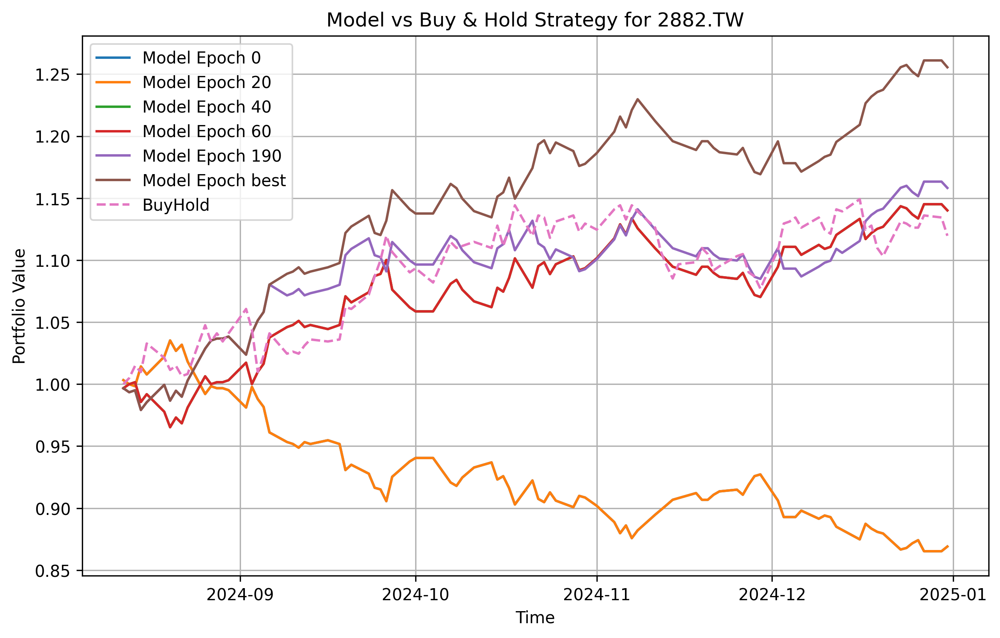
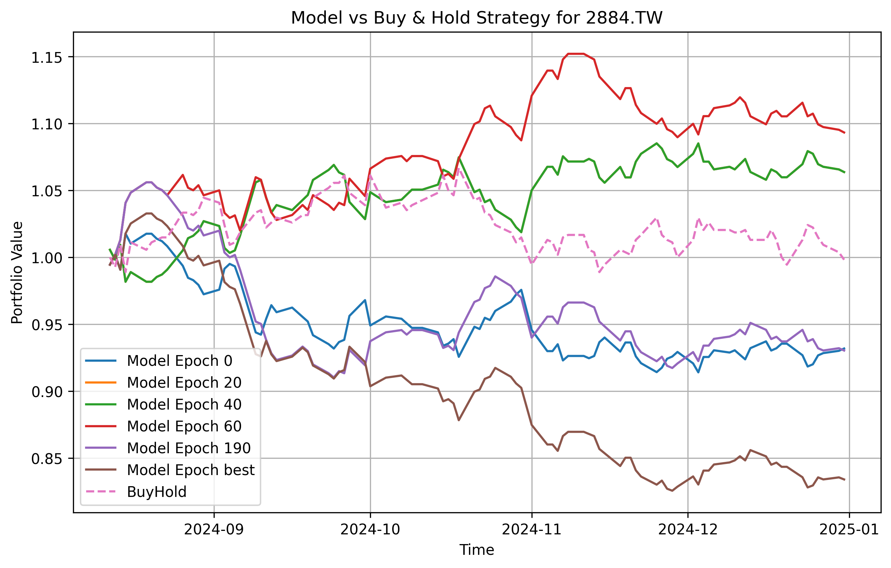

# Stock
Predict the daily percentile change for open and close price


## Usage

### Environment
```bash
# python 3.12
# cuda 12.6
pip install -r requirements.txt
```
### Train and backtest
- arg[0]: to train / test (backtest)
- arg[1]: model name
- arg[2]: stock list
- training arguements in `configs/`

#### Train
```bash
cd Stock
python main.py train --model Transformer --stock_target 2330.TW
# train 2330.TW with multiple stock
python main.py train --model Transformer --stock_target 2330.TW --stock_pool 2454.TW
# train 2884 with top 9 bank holding company
python main.py train --model Transformer --stock_target 2884.TW --stock_pool 2881.TW 2882.TW 2891.TW 2885.TW 2883.TW 2890.TW 2887.TW 2888.TW
```
#### Backtest
```bash
cd Stock
python main.py test --model Transformer --stock_target 2884.TW --stock_pool 2881.TW 2882.TW 2891.TW 2885.TW 2883.TW 2890.TW 2887.TW 2888.TW
```

## Result
### Transformer
- Stock 2882


- Stock 2884


### Transformer: comparing training with single stock and multiple stock
- Stock 2884 training with top 9 bank holding company


## Pending updates
- Decoder only model
- Resnet model

## Directories
```project_root/
│── base/                 # 🏋️ Core components
│   ├── data/             # 📊 Data handling  
│   ├── trainer/          # 🎯 Training logic  
│   ├── backtestor/       # 📈 Backtesting logic  
│  
│── results/              # 📂 Model outputs  
│   ├── {model}-temp/     # 💾 Checkpoints  
│   ├── {model}-result/   # 📊 Performance visualizations  
│  
│── scrape/               # 🕵️ Data collection  
│   ├── scrape.py         # 🔍 Scrape industry stocks  
│  
│── models.py             # 🏗️ Model definitions  
│── datas.py              # 📊 Data processing scripts  
│── trainers.py           # 🏋️ Training pipeline  
│── backtestors.py        # 📈 Backtesting implementation  
│── task.py               # 🚀 Main task execution script  
│── README.md             # 📘 Project documentation  
```


